# **FRA532 LAB1: Kalman Filter/ SLAM Report**

## **Author**
- 65340500058 Anuwit Intet

## **Introduction**
This project aims to study and develop robot localization and mapping procedures, divided into four main parts:
- **Part 0:** Calculating Wheel Odometry to determine the robot's position using the robot's wheel positions.
- **Part 1:** Performing Sensor Fusion between Wheel Odometry and IMU using an Extended Kalman Filter (EKF) to reduce errors caused by wheel rotation and slippage.
- **Part 2:** Position improvement using ICP Scan Matching, using EKF values ​​as the initial guess to generate LiDAR-based odometry.
- **Part 3:** Performing Full SLAM with slam_toolbox to compare the performance of loop closure and complete map generation.

## **Usage**

**How to run this project.**

## **Dataset Description**
The dataset is provided as a ROS bag and contains sensor measurements recorded during robot motion.

Topics included:

- **/scan**: 2D LiDAR laser scans at **5 Hz**
- **/imu**: Gyroscope and accelerometer data at **20 Hz**
- **/joint_states**: Wheel motor position and velocity at **20 Hz**

The dataset is divided into three sequences, each representing a different environmental condition:

**Sequence 00 – Empty Hallway:** A static indoor hallway environment with minimal obstacles and no dynamic objects. This sequence is intended to evaluate baseline odometry and sensor fusion performance.

**Sequence 01 – Non-Empty Hallway with Sharp Turns:** An indoor hallway environment containing obstacles and clutter, with sections of sharp turning motion. This sequence is designed to challenge odometry and scan matching performance under rapid heading changes.

**Sequence 02 – Non-Empty Hallway with Non-Aggressive Motion:** An indoor hallway environment with obstacles, similar to Sequence 2, but recorded with smoother and non-aggressive robot motion. This sequence is intended to evaluate performance under more stable motion conditions.

## **Part 0: Calculating Wheel Odometry**

### **Objective**
To establish a baseline reference and study the impact of cumulative drift caused solely by the mechanical system.

### **Theory**

There are two main ways to calculate the odometry of a differential drive robot:

**Type 1: Position-based Odometry**

This method calculates the difference in wheel angular position ($\Delta \phi$) over time, which helps reduce the accumulation of time jitter error in the ROS 2 system.

Calculate wheel distance:

$$\Delta d_{left} = R \cdot (\phi_{L, t} - \phi_{L, t-1})$$

$$\Delta d_{right} = R \cdot (\phi_{R, t} - \phi_{R, t-1})$$

$$\Delta d = \frac{(\Delta d_{right} + \Delta d_{left})}{2}$$

$$\Delta \theta = \frac{(\Delta d_{right} - \Delta d_{left})}{L}$$

Update position:

$$x_{t+1} = x_{t} + \Delta d \cos(\theta_{old} + \frac{\Delta \theta}{2})$$

$$y_{t+1} = y_{t} + \Delta d \sin(\theta_{old} + \frac{\Delta \theta}{2})$$

$$\theta_{t+1} = \theta_{t} + \Delta \theta$$

**Type 2: Velocity-based Odometry**

This method uses the angular velocity ($\omega_{wheel}$) to calculate the velocity of the robot directly, which is suitable for use in the EKF prediction step as it provides smooth velocity calculations for the robot.

Calculate velocity:

$$v = \frac{R}{2} (\omega_R + \omega_L)$$

$$\omega = \frac{R}{L} (\omega_R - \omega_L)$$

Update position with Integration:

$$x_{t+1} = x_t + v \cos(\theta_t) \Delta t$$

$$y_{t+1} = y_t + v \sin(\theta_t) \Delta t$$

$$\theta_{t+1} = \theta_t + \omega \Delta t$$

### **Methodology**

- **Data Source**: Use data from the ROS bag in all 3 sequences (00, 01, 02), focusing on data from Topic /joint_states.

- **Implementation**: Calculate odometry using both Position-based (from wheel position) and Velocity-based (from wheel velocity) methods, using wheel radius (R) = 0.033 meters and wheel base (L) = 0.16 meters to compare the differences between the two methods in all 3 sequences.

- **Path Visualization**: Plot the path of movement that is calculated from the sum of the coordinates $(x, y)$ calculated from /joint_states to compare with the scan points

- **Usage**: You can run this file to see the test results
    - wheel_odom_node.py

- **Experiment**: Perform Position-based and Velocity-based wheel odometry in all 3 sequences and analyze accuracy, drift, and robustness.

### **Result & Discussion**

**Green Line:** Position-based Odometry

**Yellow Line:** Velocity-based Odometry

``Sequence 00 Empty Hallway``

**Analysis**

- **Heading Drift**: Both modes exhibit clear heading drift when compared to the grid lines. The final coordinates fail to converge back to the starting point (closure error).

- **Path Smoothness**: The Position Mode (Green) path shows higher jitter compared to Velocity Mode (Yellow), indicating lower robustness to environmental conditions.

- **Turning Accuracy**: The green line maintains sharper rectangular corners in some instances, while the yellow line exhibits over-smoothed curves at corners.

---

``Sequence 01 Non-Empty Hallway with Sharp Turns``

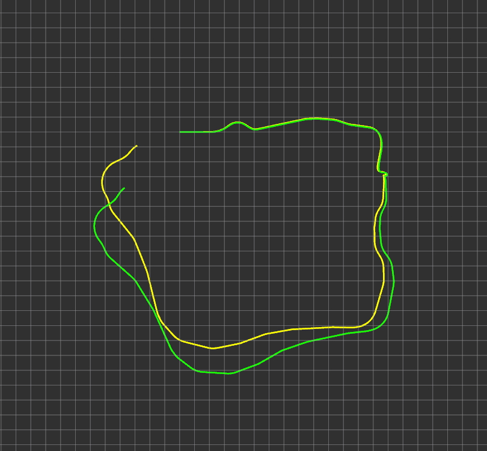

**Analysis**

- **Heading Drift**: Both modes show severe heading drift, causing significant distortion of the rectangular shape when compared to the grid lines.

- **Path Smoothness**: Position Mode (Green) exhibits high jitter and path oscillations throughout the trajectory, reflecting lower robustness to environmental noise compared to Velocity Mode (Yellow), which maintains better continuity and smoothness.

- **Turning Accuracy**: Position Mode (Green) better preserves the rectangular shape at corners despite high noise levels, while Velocity Mode (Yellow) shows over-smoothed curves at all turns.

---

``Sequence 02 Non-Empty Hallway with Non-Aggressive Motion``

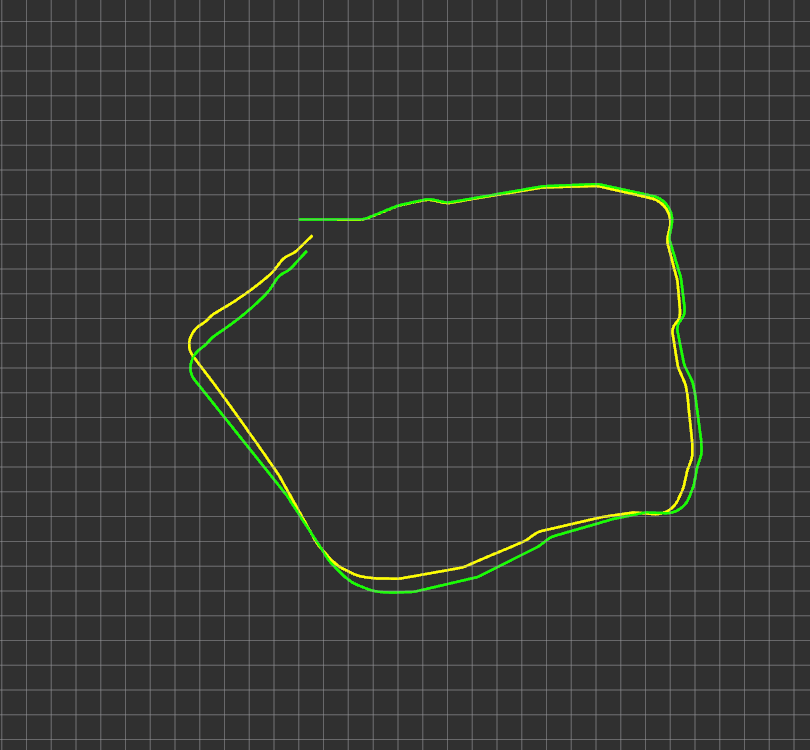

**Analysis**

- **Heading Drift**: Both modes show clear heading drift when compared to grid lines. The final coordinates fail to converge to the starting point (closure error). Additionally, there is severe accumulated "orientation loss" in certain sections, causing the rectangular shape to deviate significantly from the main axis.

- **Path Smoothness**: Position Mode (Green) consistently shows higher jitter compared to Velocity Mode (Yellow), indicating lower robustness to environmental conditions and noise. During moments of swaying or vibration, the green path responds with more severe oscillations.

- **Turning Accuracy**: The green line maintains sharper rectangular corners in some instances despite high noise levels, while the yellow line exhibits over-smoothed curves at corners.

---

``Summary``

**Heading Drift & Closure Error**: Both modes show clear accumulated error when compared to grid lines, with the final coordinates deviating significantly from the starting point, especially in sequences 01 and 02.

**Path Smoothness & Robustness**: Velocity Mode (Yellow) provides a significantly smoother path, while Position Mode (Green) exhibits high jitter, indicating lower robustness to noise.

**Turning Accuracy & Tuning**: Although the green line better preserves sharp rectangular corners in some instances, the over-smoothed curves at corners in the yellow line are "easier to tune and correct" by improving yaw accuracy from other sensors, which will be addressed in subsequent development.

**Conclusion**: Velocity Mode (yellow) is the most suitable choice for integration with EKF because EKF will compensate for its weaknesses in heading drift and over-smoothed turns, while benefiting from the smooth path as a good initial estimate.

## **Part 1: Sensor Fusion between Wheel Odometry and IMU using an Extended Kalman Filter (EKF)**

### **Objective**

Develop a state estimator using the Extended Kalman Filter (EKF) to reduce rotational errors that are often highly pronounced in wheel-only systems.

### **Theory**

In this section, we use an EKF to perform sensor fusion between wheel odometry (as the control input) and IMU yaw (as the measurement) to improve positioning accuracy.

**1. Prediction Step (Time Update)**

This step involves predicting the new state of the robot based on the kinematic model:

State Prediction:

$$\hat{x}_{t} = f(\hat{x}_{t-1}, u_t) = \begin{bmatrix} x_{t-1} + v \cos(\psi_{t-1}) \Delta t \\ y_{t-1} + v \sin(\psi_{t-1}) \Delta t \\ \psi_{t-1} + \omega \Delta t \end{bmatrix}$$

Covariance Prediction:

$$P_{t|t-1} = G_t P_{t-1} G_t^T + Q$$

**2. Update Step (Measurement Update)**

This step involves using the measured values from the sensor (IMU) to improve the predicted values:

Innovation (Measurement Residual):

$$y_t = z_t - H \hat{x}_{t}$$

Kalman Gain:

$$K_t = P_{t|t-1} H^T (H P_{t|t-1} H^T + R)^{-1}$$

State & Covariance Update:$$\hat{x}_t = \hat{x}_{t|t-1} + K_t y_t$$

$$P_t = (I - K_t H) P_{t|t-1}$$

**Definition of Variables**

$\hat{x}$ State Vector

$P$ Covariance Matrix - Shows the uncertainty of the robot's state.

$u_t$ Control Input

$G_t$ Jacobian Matrix - Linear estimation matrix of the motion model.

$Q$ Process Noise - Confidence in the model

$z_t$ Measurement - The actual measured value, in this case, is the yaw angle from the IMU.

$H$ Observation Model - Matrix that specifies which sensor measures which state (in this case, only $Yaw$)

$R$ Sensor Noise - Confidence in the sensor

$K_t$ Kalman Gain - Weighting factor between "predicted value" and "actual measured value"

**To determine the position of a two-wheeled robot, each matrix can be defined as follows:**

``State Vector``

$$\hat{x}_{t} = f(\hat{x}_{t-1}, u_t) = \begin{bmatrix} x_{t-1} + v \cos(\psi_{t-1}) \Delta t ; y_{t-1} + v \sin(\psi_{t-1}) \Delta t ; \psi_{t-1} + \omega \Delta t \end{bmatrix}$$

``Jacobian Matrix``

$$G_t = \frac{\partial f}{\partial \mathbf{x}} = \begin{bmatrix} \frac{\partial f_x}{\partial x} & \frac{\partial f_x}{\partial y} & \frac{\partial f_x}{\partial \psi} ; \frac{\partial f_y}{\partial x} & \frac{\partial f_y}{\partial y} & \frac{\partial f_y}{\partial \psi} ; \frac{\partial f_\psi}{\partial x} & \frac{\partial f_\psi}{\partial y} & \frac{\partial f_\psi}{\partial \psi} \end{bmatrix} = \begin{bmatrix} 1 & 0 & -v \sin(\psi) \Delta t ; 0 & 1 & v \cos(\psi) \Delta t ; 0 & 0 & 1 \end{bmatrix}$$

``Process Noise Matrix``

$$Q = \begin{bmatrix} \sigma_x^2 & 0 & 0 ; 0 & \sigma_y^2 & 0 ; 0 & 0 & \sigma_\psi^2 \end{bmatrix}$$

- Model reliability coefficient
    - If the value is low, the system trusts the model more.
    - If the value is high, the system trusts the IMU more.

``Sensor Noise Matrix``

$$R = [\sigma_{imu\_yaw}^2]$$

- $\sigma_{imu\_yaw}^2$: The variance of the IMU signal. 
    - **Small value:** The system will trust the IMU more (the path will be straighter, but may wobble due to sensor noise). 
    - **Large value:** The system will trust it less (the path will be smooth, but will accumulate drift easily).

``Initial State Covariance Matrix``

$$P_0 = \begin{bmatrix} p_{xx} & 0 & 0 ; 0 & p_{yy} & 0 ; 0 & 0 & p_{\psi\psi} \end{bmatrix}$$

``Observation Model Matrix``

$$H = \begin{bmatrix} 0 ; 0 ; 1 \end{bmatrix}$$

In this case, the observation model is only $Yaw$

``Measurement``

In this case, the measurement is the yaw angle from the IMU.

### **Setup**

- Data Source: Use data from the ROS bag in all 3 sequences (00, 01, 02), focusing on data from Topic /joint_states for wheel odometry and /imu for EKF measurement.

- Implementation: 
    - Calculate wheel odometry using Velocity-based (from wheel velocity) methods as a initial guess, using wheel radius (R) = 0.033 meters and wheel base (L) = 0.16 meters. 
    - Perform EKF to improve the accuracy of the wheel odometry by using /joint_state and angular velocity from /imu as a prediction step and orientation from /imu as a update step.

- Path Visualization: Plot the path of movement from EKF in each timestep on rviz2.

- Experiment: Perform EKF in variance of $Q$ and $R$ in all 3 sequences and analyze accuracy, drift, and robustness.
    - Experiment 1: $Q$ = 0.000001, 0.001, 1.0, 1000.0 and $R$ = 0.1
    - Experiment 2: $R$ = 0.0001, 0.1, 1000.0, 100000.0 and $Q$ = 0.001
    - Choose the best $Q$ and $R$ and compare the results to Velocity-based odometry.

### **Result & Discussion**

``Experiment 1: Adjust process noise``

R = 0.1

**Yellow Line**: Q = 0.000001

**Green Line**: Q = 0.001

**Cyan Line**: Q = 1.0

**Red Line**: Q = 1000.0

**Sequence 00**
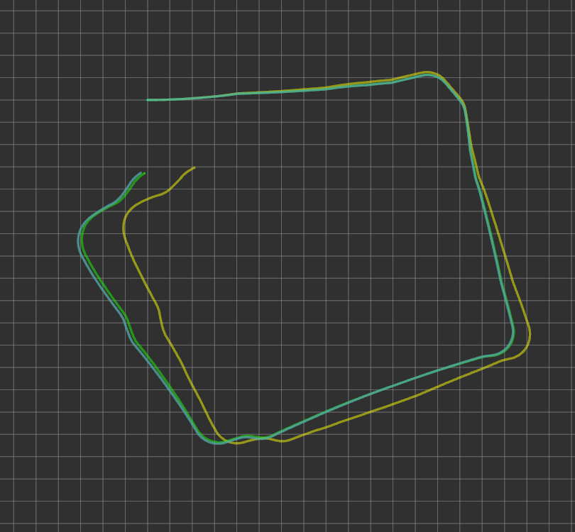

**Sequence 01**
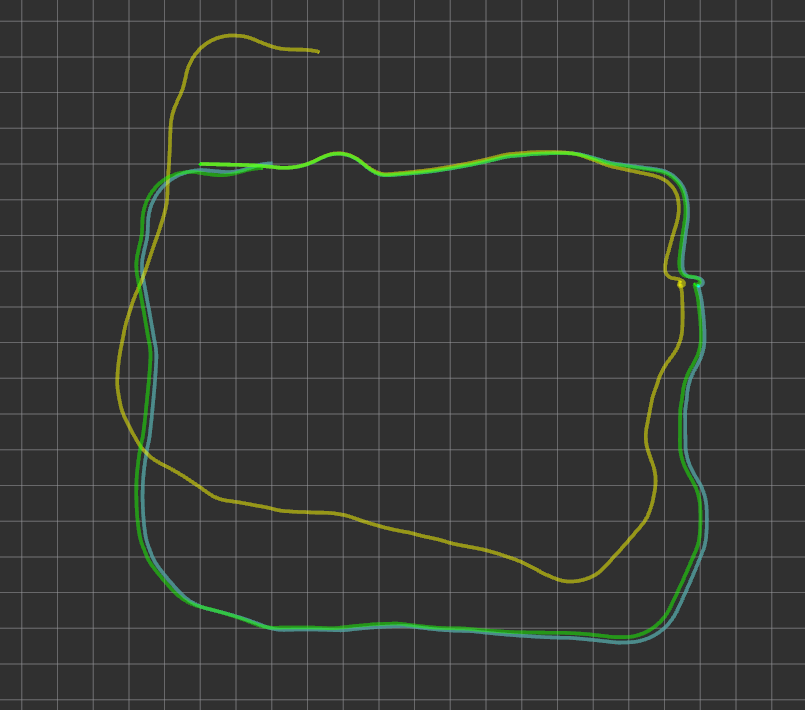
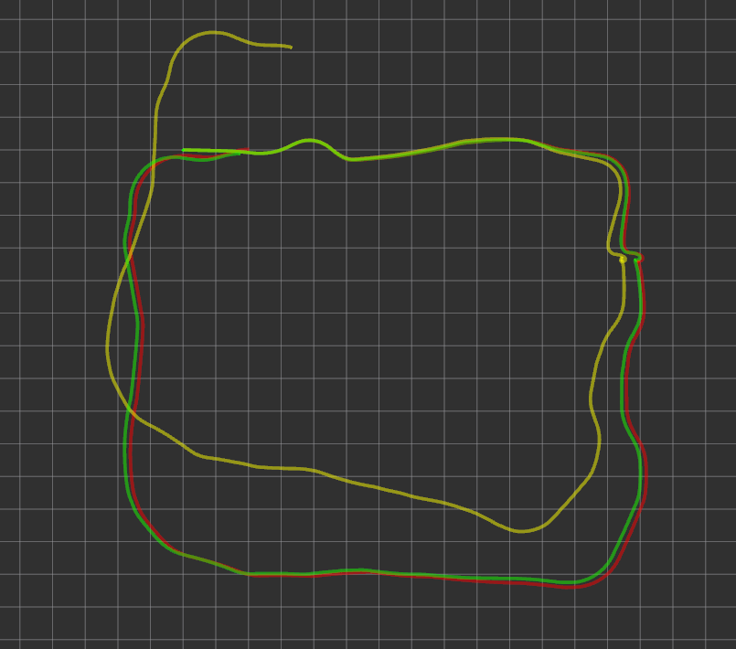

**Sequence 02**
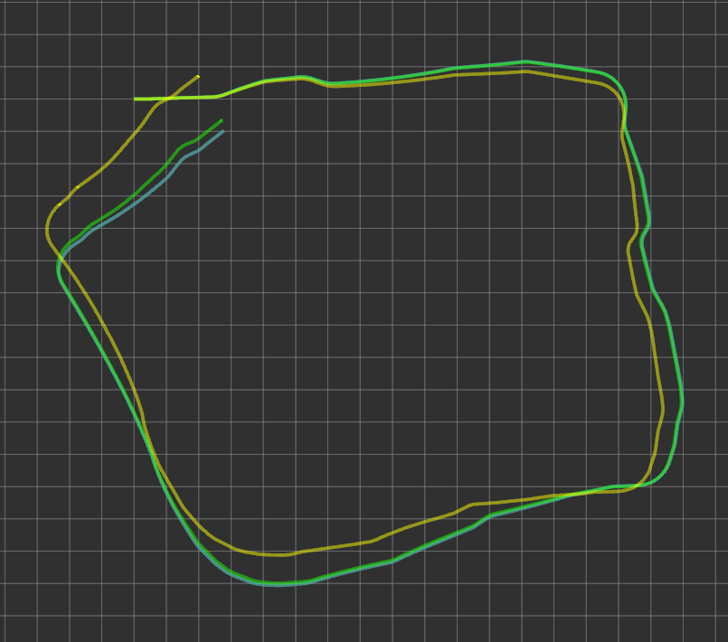
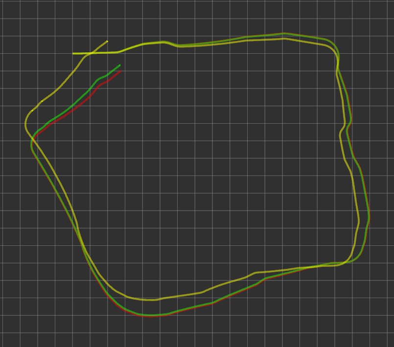

**Analysis:**

**Geometric Fidelity**: The green line demonstrates the highest performance in maintaining the "rectangular shape," with sharper and more perpendicular corners compared to other lines. The yellow line exhibits more "turning deviation" than other colors.

**Jitter vs. Stability**: The yellow line shows significant path oscillations or "shaking" throughout the trajectory, caused by low process noise ($Q$) settings, making the system more sensitive to sensor noise.

**Heading & Drift**: In straight sections, the green line demonstrates the most responsive heading change capability, similar to cyan and red lines, making the overall path most consistent with the robot's intended rectangular motion pattern.

**Conclusion**: When measured by rectangular shape and geometric accuracy, the green line performs best due to appropriately balanced process noise ($Q$). Setting process noise too low makes the system overly sensitive to sensor noise.

---

``Experiment 2: Adjust measurement noise``

Q = 0.001

**Yellow Line**: R = 0.0001

**Green Line**: R = 0.1

**Cyan Line**: R = 1000.0

**Red Line**: R = 100000.0

**Sequence 00**
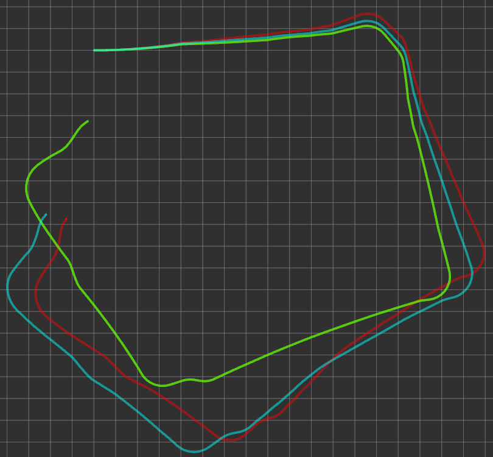
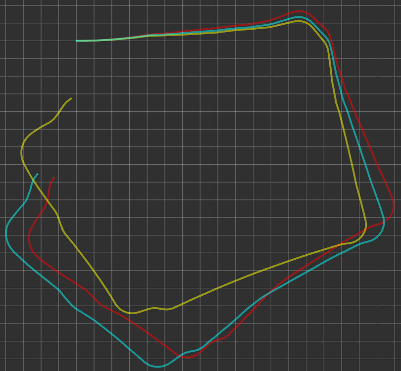

**Sequence 01**
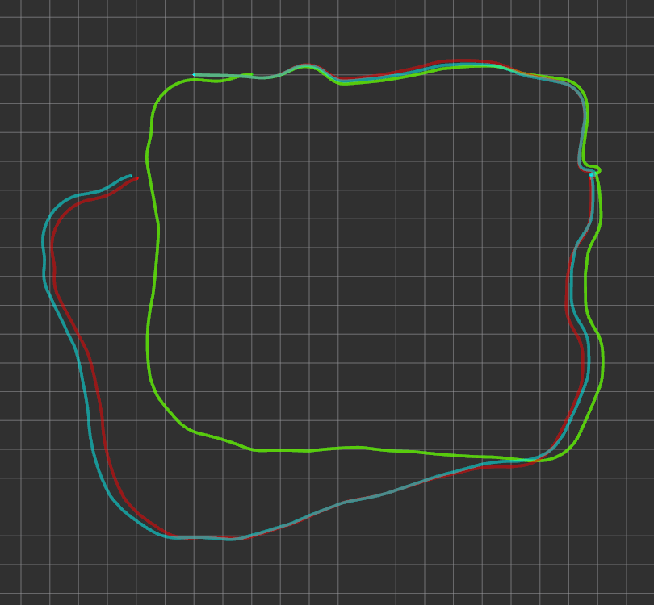
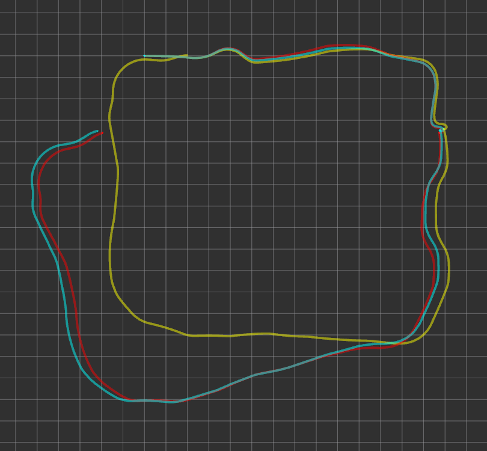

**Sequence 02**
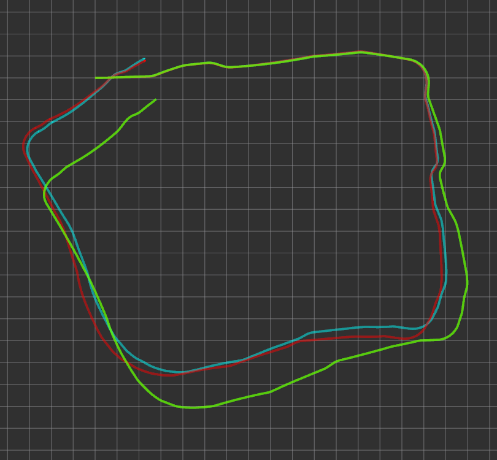
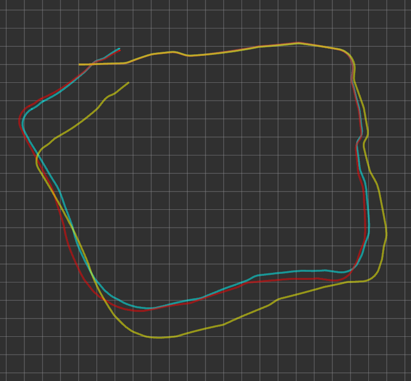

**Analysis:**

From analyzing all 3 sequences with emphasis on "rectangular squareness" (Geometric Squareness):

**Geometric Fidelity**: The green (lime) line performs best in maintaining "90-degree right angles" and sharp rectangular shapes, while cyan and red lines exhibit "turning deviation."

**Jitter vs. Stability**: Although the green line maintains the best rectangular shape, it comes at the cost of "roughness" or "shaking" (High Jitter) throughout the path.

**Heading & Drift**: In straight sections, both green and yellow lines maintain parallelism with grid lines quite similarly. However, the green line shows more responsive and accurate heading changes, resulting in a noticeably more rectangular overall shape across all sequences.

**Conclusion**: When measured by rectangular shape and geometric accuracy, green and yellow lines perform best (paths overlap). This is due to appropriately low measurement noise ($R$). Setting measurement noise too high prevents the system from trusting sensor readings, causing over-reliance on the model. Since the model alone cannot achieve perfect rectangular motion, lower $R$ values allow the system to trust the sensor more.

---

``Compare the results to Velocity-based odometry``

**Yellow Line**: EKF Odometry

**Green Line**: Velocity-Based Wheel Odometry

**Sequence 00**
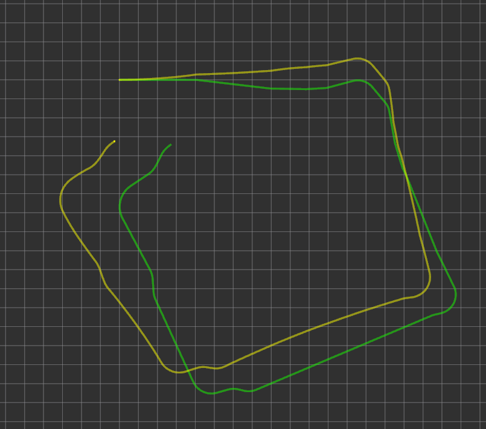

**Sequence 01**
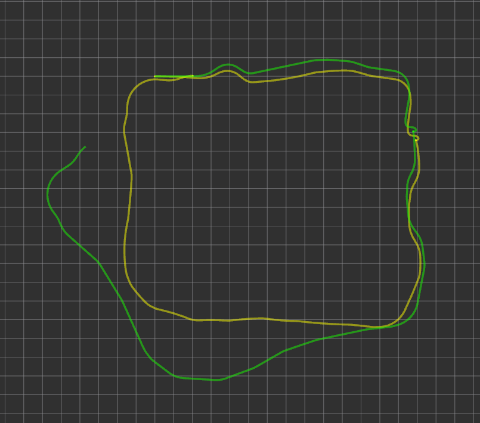

**Sequence 02**
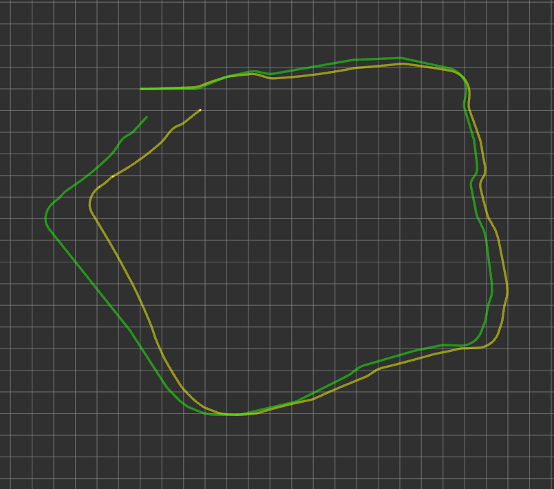

**Analysis:**

From comparing Velocity-based Wheel Odometry (green line) and EKF Odometry (yellow line) across different scenarios:

**Heading Drift and Angular Accuracy**: The yellow line (EKF) demonstrates superior heading maintenance compared to the green line across multiple sequences. Particularly during cornering maneuvers requiring parallelism with grid lines, the yellow line shows less distortion at the beginning of each segment.

**Path Smoothness and Noise Robustness**: The green line (Velocity-based), while continuous, exhibits more "roughness" or path inconsistency (jitter) in certain sections compared to the yellow line.

**Turning Accuracy and Geometric Shape**: During 90-degree turns, the green line may preserve corner sharpness better at some points but often comes with overshooting or jerky coordinates. Meanwhile, the yellow line (EKF) maintains balance between turning and continuity, resulting in a more symmetrical and stable overall rectangular shape.

**Conclusion**: The yellow line (EKF Odometry) is superior because EKF can integrate additional data (e.g., from IMU) to correct heading, overcoming the limitations of Wheel Odometry which tends to drift easily when wheel slippage occurs.

## **Part 2: Position improvement using ICP Scan Matching**

### **Objective**

To refine the EKF-based odometry using LiDAR scan matching and evaluate the improvement in accuracy and drift.

### **Theory**

The Iterative Closest Point (ICP) algorithm is a fundamental technique for geometric registration. It refines the robot's pose by iteratively aligning a current LiDAR scan (Source) with a reference model (Target), such as a previous scan or a global map. The core objective is to minimize a defined error metric between these two data sets to achieve decimeter-level localization accuracy.

Depending on the environment's structure, different error metrics can be employed:

1. **Point-to-Point ICP**: This is the "classic" version of ICP. It treats the LiDAR data as a simple set of coordinates without considering the geometry of the environment.

- Logic: It calculates the Euclidean distance directly between source point $p_i$ and the nearest target point $q_i$.

- Error Function: $E = \sum || p_i - q_i ||^2$

- Characteristics:

    - Pros: Minimal computation per iteration; easy to implement.

    - Cons: Struggles with "sliding" along flat walls. If the robot moves parallel to a wall, the points may pull toward each other incorrectly, leading to longitudinal drift.

2. **Point-to-Plane ICP**: This version is more "geometry-aware" and is the standard for indoor mobile robotics where flat surfaces (walls) are prevalent.

- Logic: Instead of pulling a point toward another point, it pulls the point toward the tangent plane (or line in 2D) of the target surface.

- Error Function: $E = \sum ((p_i - q_i) \cdot n_i)^2$ (where $n_i$ is the surface normal).

- Characteristics:

    - Pros: Much faster convergence. It allows points to "slide" along the wall as long as they stay on the same plane, which is exactly how LiDAR scans behave on long corridors.

    - Cons: Requires calculating surface normals for every point, which adds a slight initial computational cost.

**ICP steps**

1. Point Cloud Pre-processing:
    - Convert raw LaserScan data (ranges and angles) into 2D Cartesian coordinates $(x, y)$.
    - **Downsampling**: Pick every $n^{th}$ point (e.g., every 5th point) to reduce computational load while maintaining structural features.

2. Initial Guess:
    - Apply the current estimated pose from Odometry/EKF to the current scan to bring it close to the target scan.

3. Nearest Neighbor Association:
    - For each point in the current scan, find the closest point in the previous scan.
    - Implementation Note: We use KDTree for efficient spatial searching, reducing complexity from $O(N^2)$ to $O(N \log N)$.
    - When transitioning to Point-to-Plane, the algorithm not only finds the nearest point but also estimates the surface normal of the local neighborhood.

4. Motion Estimation:
    - Calculate the Singular Value Decomposition (SVD) to find the optimal Rotation ($R$) and Translation ($T$) that minimizes the Mean Squared Error (MSE) between the paired points. For Point-to-Plane, we transition to a Non-linear Optimizer to account for surface normals, providing better stability in structured environments

5. Jump Detection & Validation
The ICP output pose is rejected if it produces an aggressive motion jump beyond predefined bounds. In that case, the system falls back to EKF odometry to prevent incorrect pose updates.

If ICP fail

6. Failure Handling (Fallback to EKF)
If ICP fails (e.g., not enough valid points, poor convergence, or unreliable matching), the system uses EKF odometry instead to avoid applying a wrong alignment.

If not

6. Transformation Update:
    - Apply the calculated $R$ and $T$ to the current point cloud.

7. Iteration & Convergence:
    - Repeat steps 3–5 until the change in error is below a threshold (EPS) or the maximum number of iterations (MAX_ITER) is reached.

This implementation can be enhanced with Outlier Rejection using distance thresholds and Initial Guess Integration from EKF. These techniques ensure the ICP remains robust even in dynamic environments with moving obstacles.

**Outlier Rejection Strategies in ICP**

To ensure the robustness of our system, especially in dynamic or noisy environments, we implement a Multi-stage Outlier Rejection pipeline. This prevents "bad data" (like moving people or sensor noise) from distorting the robot's localization.

**1. Pre-Filtering (Raw Data Cleaning)**: Filters out noise and reduces computational load before the matching process begins.
- Voxel Grid Filtering:
    - Method: Divides the 2D space into small grids (Voxels) and replaces all points within a grid with their centroid.
    - Benefit: Manages High-Density areas where overlapping points could disproportionately bias the optimization. It ensures a uniform distribution of data.

**2. Correspondence Rejection (Post-Matching Filter)**: Filters point pairs after the Nearest Neighbor search but before calculating the transformation ($R, T$).
- Distance Thresholding:
    - Method: Rejects point pairs if the distance between the source and target exceeds a set limit (e.g., 0.5m).
    - Rationale: Large distances often indicate Dynamic Objects (e.g., a person walking past) that do not exist in the reference map.

### **Setup** 

- Data Source: Use data from the ROS bag in all 3 sequences (00, 01, 02), focusing on data from Topic /joint_states and /imu for EKF-based odometry and /scan for ICP-based odometry.

- Implementation: Perform EKF-based odometry as a initial guess for ICP-based odometry. I implement 2 approach of data association that is point-to-point and point-to-plane to compare the results.

- Map Visualization: Show the structure of the walls that the robot scans throughout the path on rviz2.

- Path Visualization: Plot the path of movement from EKF and ICP in each timestep on rviz2.

- Experiment: Perform ICP with EKF with 2 data association approachs that is point-to-point and point-to-plane.
    - Experiment 1: Compare data association approach that is point-to-point and point-to-plane.
    - Experiment 2: Choose the best approach above compare to traditional EKF.

### **Result & Discussion**

``Experiment 1: Compare data association approach``

**Sequence 00**

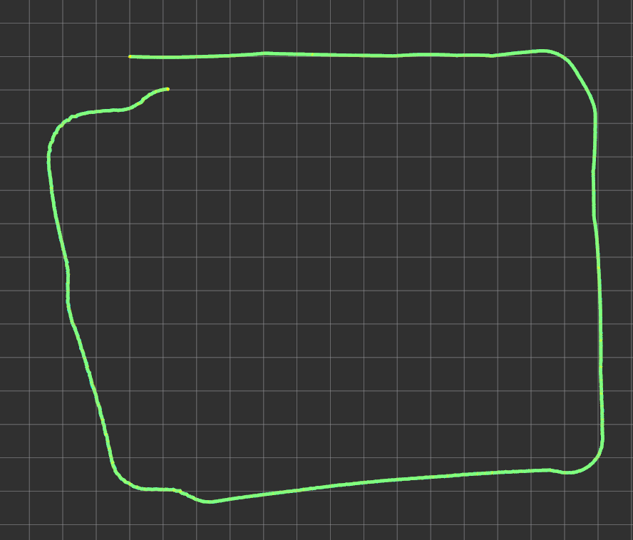
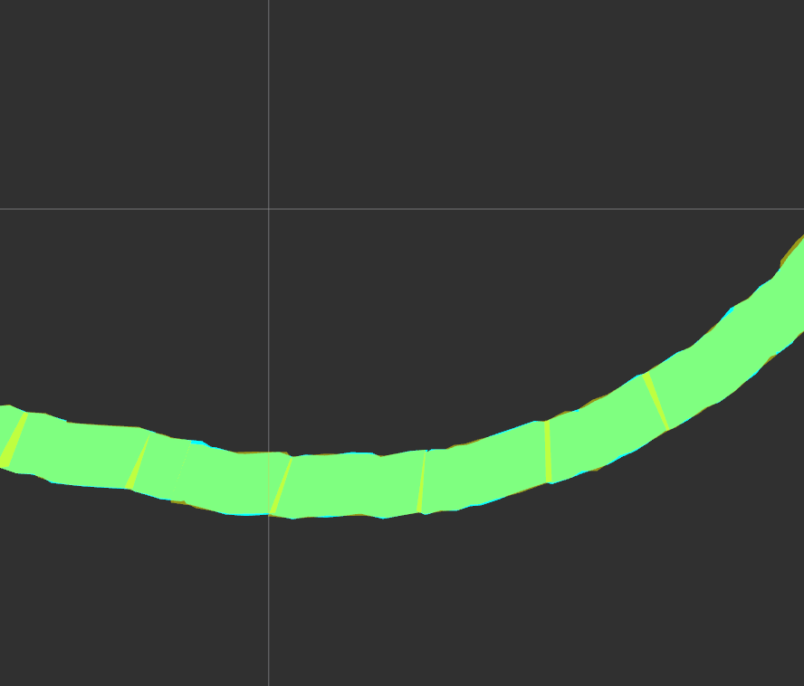
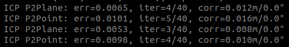

**Sequence 01**

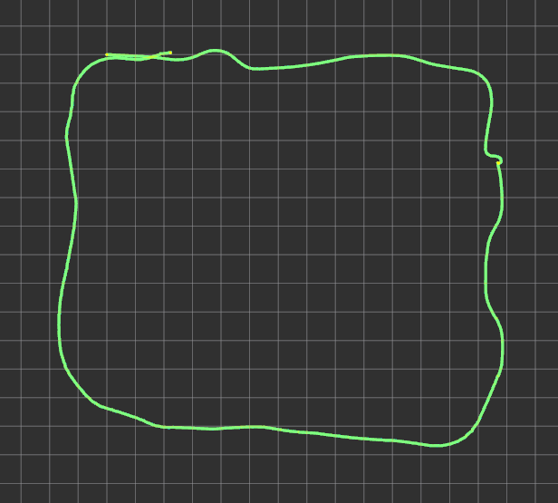
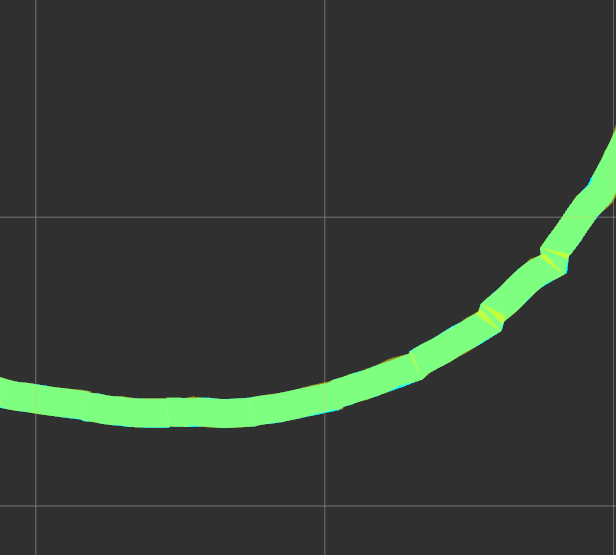
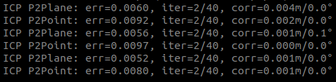

**Sequence 02**

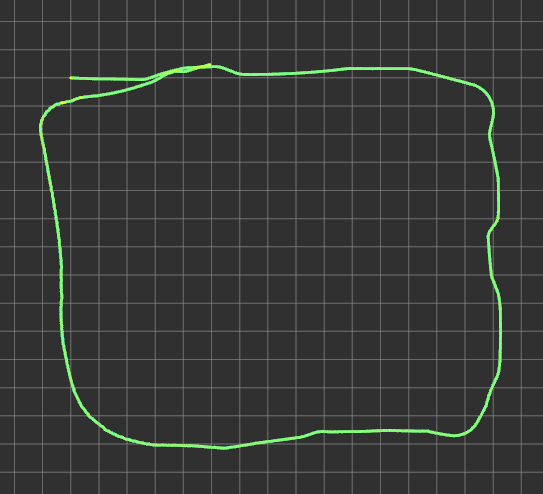
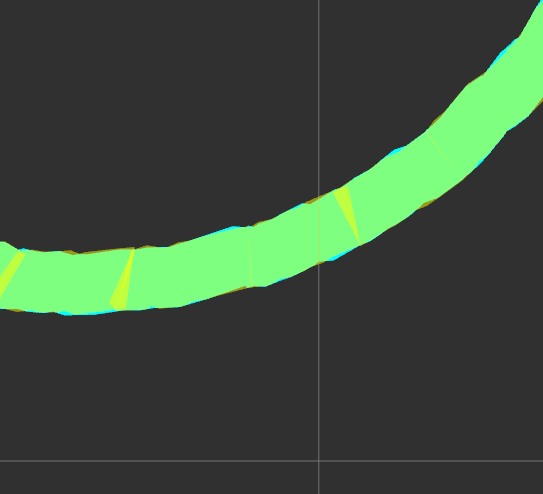

**Analysis:**

Testing reveals that both approaches produce highly similar path results in physical terms. However, when examining deeper performance metrics, the Point-to-Plane algorithm demonstrates technical superiority:

- **Convergence Speed & Stability**: Processing log data shows that Point-to-Plane requires fewer iterations than Point-to-Point in identical scenarios, reflecting faster and more efficient convergence.

- **Accuracy & Error Metrics**: Point-to-Plane consistently achieves lower error (err) values than Point-to-Point across all comparison points. For example, in the first line, Point-to-Plane yields err=0.0068 compared to Point-to-Point's err=0.102, demonstrating that calculations based on surface planes (plane normals) provide higher point-matching accuracy than direct point-to-point comparison.

**Conclusion**: Although path shape results appear similar, Point-to-Plane is the superior choice due to higher accuracy and faster convergence.

---

``Experiment 2: Compare ICP with EKF to traditional EKF``

- Light Green Line: ICP + EKF
- Dark Green Line: Traditional EKF

**Sequence 00**

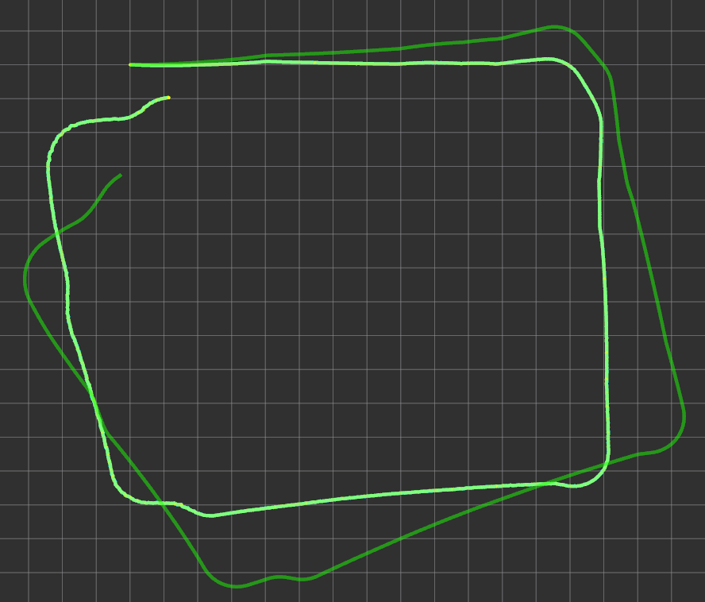

**Sequence 01**

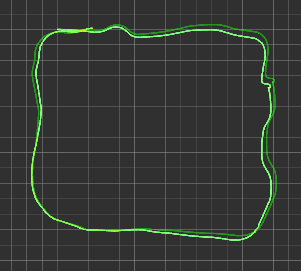

**Sequence 02**

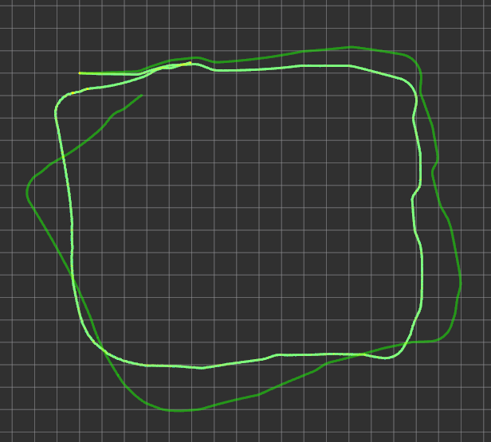

**Analysis:**

From comparing EKF Odometry (dark green) and ICP Odometry (light green) across all 3 test sequences:

- **Heading & Drift Correction**: The light green line (ICP) demonstrates significantly superior drift correction capability. This is particularly evident in sequences 1 and 3, where the dark green line (EKF) progressively "loses direction" and deviates increasingly from the rectangular path, while ICP successfully pulls coordinates back to align with the original map structure.

- **Geometric Precision**: The light green line (ICP) maintains rectangular shapes and right angles much closer to a "perfect map." This is observable from the path's parallelism with grid lines, which is superior to the dark green line (EKF) that exhibits higher cumulative angular distortion.

- **Loop Closure Capability**: In sequences 2 and 3, the final coordinates of the light green line (ICP) return much closer to the starting point (lower closure error), while the dark green line (EKF) typically ends at a more distant position. This reflects that EKF alone cannot "perceive" environmental structure to correct accumulated errors like ICP can.

**Conclusion**: The light green line (ICP Odometry) is superior because ICP has the advantage of comparing LiDAR scan data with reference maps, enabling it to eliminate accumulated drift inherent in EKF's dead-reckoning system. ICP can track environmental geometric structures more accurately, making it suitable for applications requiring high spatial precision.

## **Part 3: Full SLAM with slam_toolbox**

This part is collaborate with Mr.Pavaris Asawakijtananont.

### **Objective**

To perform full SLAM using slam_toolbox and compare its pose estimation and mapping performance with the ICP-based odometry from Part 2.

### **Theory**

This part utilizes Slam Toolbox, a powerful 2D SLAM framework developed by Steve Macenski. It provides a comprehensive set of tools for mapping and localization, outperforming many free and commercial alternatives.

**Key Features**

- **Standard 2D SLAM**: Supports the "point-and-shoot" mapping workflow (start, map, and save .pgm files) with built-in utilities.

- **Lifelong Mapping**: Ability to load a saved pose-graph and continue mapping while automatically removing extraneous or redundant information.

- **Pose-Graph Refinement**: Refine, remap, or continue mapping from a serialized pose-graph at any time.

- **Advanced Localization**: Features an optimization-based localization mode. It can also run in "LiDAR Odometry" mode without a prior map using local loop closures.

- **Dual Processing Modes**: Supports both Synchronous and Asynchronous mapping modes to balance between processing all scans and maintaining real-time performance.

- **Ceres Optimizer**: Powered by a new optimized plugin based on Google Ceres for high-performance graph optimization.

- **Interactive Tools**: Includes an RVIZ plugin for direct interaction, allowing manual manipulation of nodes and graph connections.

**Parameters**

slam_toolbox has numerous parameters, but here are the most important ones:

**1. Update Thresholds Parameters**

This group controls when the robot adds new data to the map. Lowering these values increases map detail but requires more computational resources:

- **minimum_travel_distance**: Minimum distance the robot must travel before updating a new scan to the map. For robots operating in confined spaces, this can be reduced to 0.1 - 0.2 meters.

- **minimum_travel_heading**: Minimum rotation angle (radians) before updating a scan. If the robot turns frequently but the map distorts at corners, try reducing this value for more detailed corner updates.

- **map_update_interval**: Time interval (seconds) for updating the displayed map. For more real-time visualization, adjust to 1.0 - 2.0 seconds.

**2. Scan Matching & Solver Parameters**

This group affects wall edge sharpness and noise handling:

- **use_scan_matching**: Set to true to use ICP for pose correction.

- **max_laser_range**: Maximum laser range to use for mapping. Should be adjusted close to the actual LiDAR sensor specifications for optimal data stability.

- **distance_variance_penalty & angle_variance_penalty**: Penalty values when the scan matcher is uncertain about distance or angle. If you notice the map "jumping" or "drifting" frequently during turns, try increasing these values to enforce stricter matching.

**3. Loop Closure Parameters**

- **loop_search_maximum_distance**: Radius within which the system searches for old loops to create links. If the robot drifts beyond 3 meters, the system won't recognize it as the same location. May need to increase this if the robot accumulates high error.

- **loop_match_minimum_response_fine**: Minimum confidence threshold for accepting loop closures. If experiencing "ghost maps" (hallucinations) or frequent wall overlaps, increase this value for stricter validation.

**4. System Performance Parameters**

- **transform_publish_period**: Frequency of TF broadcasts. If CPU is overloaded causing odometry latency, this can be increased.

- **resolution**: Map resolution. For sharper maps in complex areas, can be adjusted to 0.01 - 0.03, but this significantly increases memory usage.

To compare the performance we will use vanilla version on slamtoolbox

slamtoolbox reference : https://github.com/SteveMacenski/slam_toolbox

### **Setup**

- Data Source: Use data from the ROS bag in all 3 sequences (00, 01, 02), focusing on data from Topic /scan for send to slam_toolbox.

- Implementation: 
    - Utilize the Synchronous mode to ensure that every single LaserScan message is processed and integrated into the pose-graph.
    - Use EKF odometry from Part 1 as a odometry source for slam_toolbox and enable ICP mode in slam_toolbox.

- Map Visualization: Show the map from slam_toolbox using topic /map on rviz2.

- Path Visualization: Plot the path of movement from slam_toolbox on rviz2.

- Experiment: Run slam_toolbox on all 3 sequences (00, 01, 02). Compare the map with ICP-based odometry from Part 2. And compare the path with other odometry using vanilla parameter version on slamtoolbox.

### **Result & Discussion**

**MAP**

The maps generated by slam_toolbox and our ICP-based method exhibit a high degree of similarity across most sequences. The notable exception is Map 2, where slam_toolbox produces a result closest to a "perfect" closed loop, suggesting superior trajectory alignment despite loop closure being disabled in our experiments. In Maps 0 and 1, the performance between the two methods is comparable. Notably, in Map 1, slam_toolbox demonstrates effective node optimization by removing redundant nodes during sharp turns, a feature that enhances robustness against sensor "hallucinations" or artifacts caused by rapid rotation.

Furthermore, slam_toolbox exhibits denser trajectory and map updates compared to our approach. This higher update frequency stems from slam_toolbox updating the pose with nearly every incoming scan, whereas our ICP pipeline utilizes a keyframe-based strategy for local map insertion. Despite this lower update frequency, our ICP method proves capable of achieving a nearly closed-loop reconstruction, demonstrating the efficiency of the keyframe approach in maintaining map consistency.

**ODOM**

The results demonstrate that loop closure error alone is not a definitive indicator of odometry performance across different algorithms. When evaluating "odometry shape" and map-tracking capability, both ICP and slam_toolbox odometry significantly outperform the alternatives. While other methods might occasionally yield smaller distance errors, they fail to maintain a consistent trajectory relative to the map. Maps generated from raw wheel odometry or EKF-based odometry exhibit substantial drift and misalignment. In contrast, only the ICP and slam_toolbox approaches successfully follow the environment's true geometry, producing maps that most closely resemble a "perfect" reference while other odometry methods drift away from the mapped structures.

## **Conclusion**

Optimizing SLAM performance requires the integration of complementary sensor data to minimize drift and disorientation. Positional accuracy depends on the quality of the raw data and the precise tuning of the algorithm. To ensure the system can reliably handle environments lacking geometric features.

**Wheel Odometry**

Wheel odometry prediction using kinematics often suffers from error accumulation (drift) due to uncertainties in real-world environments, such as wheel slip and heading drift, which affect accuracy after turns. Testing has shown that velocity-based odometry is more efficient than position-based odometry. Therefore, this model was enhanced with EKF.

**EKF (Sensor Fusion)**

The use of an EKF (Extended Kalman Filter) significantly improves performance beyond conventional wheel odometry by integrating the motion model with sensor data (e.g., IMU yaw) to balance prediction and actual measurements. This significantly improves stability and reduces drift, especially in the heading phase. However, the key to optimal performance lies in fine-tuning the process noise and measurement noise. This allows the system to balance the reliability between the motion model and the sensors, which requires precise tuning of these parameters. This can reduce cumulative errors and result in a more geometrically accurate path than using data from the wheels alone.

**ICP Scan Matching Refinement with EKF**

The use of an EKF (Extended Kalman Filter) elevates position prediction beyond typical wheel odometry by integrating motion models with sensor data such as IMUs to reduce drift and improve heading stability. Furthermore, combining Iterative Closest Point (ICP) with EKF helps solve cumulative positional and directional errors by comparing LiDAR scans with maps, especially using point-to-plane algorithms, which are more efficient than point-to-point algorithms. Due to its higher geometric tolerance, it reduces local minima sticking and allows coordinates to converge to the true position more quickly and stably while the robot is making sharp turns. However, the main limitation of ICP is its reliance on sufficient geometric features and scan overlap; in environments lacking distinct features or during rapid turns, ICP may fail to converge, leading to significant errors.

**slam_toolbox**

Slam_toolbox is a comprehensive SLAM framework that typically outperforms local ICP refinement by continuously performing scan matching and applying loop closure and global optimization (pose graph correction) when revisiting locations. This results in cleaner and more globally consistent maps, especially when loop closures are successfully detected. However, slam_toolbox still depends on sensor quality and tuning; inaccurate odometry/IMU or poor scan quality can degrade performance.

## **Reference**

Collaborator : https://github.com/PavarisAsawa/FRA532-Lab1-EKF_SLAM

Presentation Slide : https://www.canva.com/design/DAHBGQt0iWQ/pEniAY8PZd4fy1aPmfsX4Q/view?utm_content=DAHBGQt0iWQ&utm_campaign=designshare&utm_medium=link2&utm_source=uniquelinks&utlId=h37da07444c

Differential Drive Model : https://automaticaddison.com/calculating-wheel-odometry-for-a-differential-drive-robot/

RoboticsPython : https://github.com/AtsushiSakai/PythonRobotics

slamtoolbox : https://github.com/SteveMacenski/slam_toolbox
