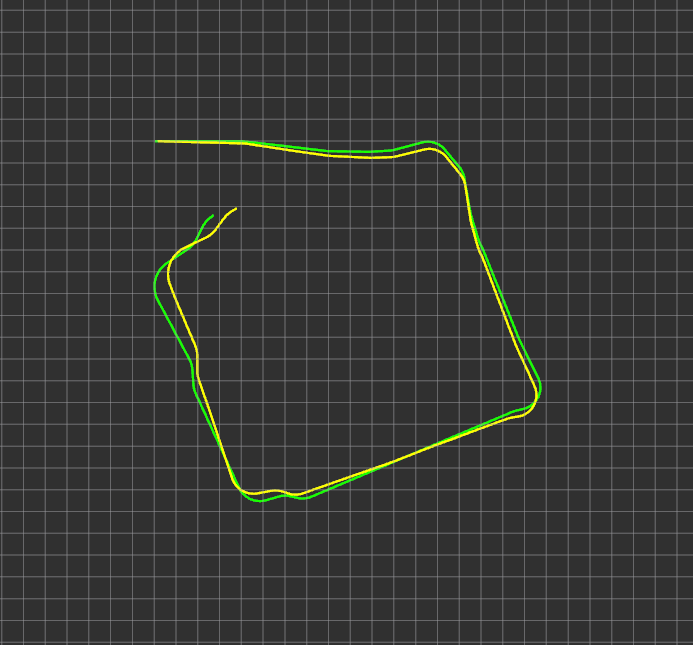

# **FRA532 LAB1: Kalman Filter/ SLAM Report**

## **Author**
- 65340500058 Anuwit Intet

## **Introduction**
This project aims to study and develop robot localization and mapping procedures, divided into four main parts:
- **Part 0:** Calculating Wheel Odometry to determine the robot's position using the robot's wheel positions.
- **Part 1:** Performing Sensor Fusion between Wheel Odometry and IMU using an Extended Kalman Filter (EKF) to reduce errors caused by wheel rotation and slippage.
- **Part 2:** Position improvement using ICP Scan Matching, using EKF values ​​as the initial guess to generate LiDAR-based odometry.
- **Part 3:** Performing Full SLAM with slam_toolbox to compare the performance of loop closure and complete map generation.

## **Usage**

**How to run this project.**

## **Dataset Description**
The dataset is provided as a ROS bag and contains sensor measurements recorded during robot motion.

Topics included:

- **/scan**: 2D LiDAR laser scans at **5 Hz**
- **/imu**: Gyroscope and accelerometer data at **20 Hz**
- **/joint_states**: Wheel motor position and velocity at **20 Hz**

The dataset is divided into three sequences, each representing a different environmental condition:

**Sequence 00 – Empty Hallway:** A static indoor hallway environment with minimal obstacles and no dynamic objects. This sequence is intended to evaluate baseline odometry and sensor fusion performance.

**Sequence 01 – Non-Empty Hallway with Sharp Turns:** An indoor hallway environment containing obstacles and clutter, with sections of sharp turning motion. This sequence is designed to challenge odometry and scan matching performance under rapid heading changes.

**Sequence 02 – Non-Empty Hallway with Non-Aggressive Motion:** An indoor hallway environment with obstacles, similar to Sequence 2, but recorded with smoother and non-aggressive robot motion. This sequence is intended to evaluate performance under more stable motion conditions.

## **Part 0: Calculating Wheel Odometry**

### **Objective**
To establish a baseline reference and study the impact of cumulative drift caused solely by the mechanical system.

### **Theory**

There are two main ways to calculate the odometry of a differential drive robot:

**Type 1: Position-based Odometry**

This method calculates the difference in wheel angular position ($\Delta \phi$) over time, which helps reduce the accumulation of time jitter error in the ROS 2 system.

Calculate wheel distance:

$$\Delta d_{left} = R \cdot (\phi_{L, t} - \phi_{L, t-1})$$

$$\Delta d_{right} = R \cdot (\phi_{R, t} - \phi_{R, t-1})$$

$$\Delta d = \frac{(\Delta d_{right} + \Delta d_{left})}{2}$$

$$\Delta \theta = \frac{(\Delta d_{right} - \Delta d_{left})}{L}$$

Update position:

$$x_{t+1} = x_{t} + \Delta d \cos(\theta_{old} + \frac{\Delta \theta}{2})$$

$$y_{t+1} = y_{t} + \Delta d \sin(\theta_{old} + \frac{\Delta \theta}{2})$$

$$\theta_{t+1} = \theta_{t} + \Delta \theta$$

**Type 2: Velocity-based Odometry**

This method uses the angular velocity ($\omega_{wheel}$) to calculate the velocity of the robot directly, which is suitable for use in the EKF prediction step as it provides smooth velocity calculations for the robot.

Calculate velocity:

$$v = \frac{R}{2} (\omega_R + \omega_L)$$

$$\omega = \frac{R}{L} (\omega_R - \omega_L)$$

Update position with Integration:

$$x_{t+1} = x_t + v \cos(\theta_t) \Delta t$$

$$y_{t+1} = y_t + v \sin(\theta_t) \Delta t$$

$$\theta_{t+1} = \theta_t + \omega \Delta t$$

### **Methodology**

- **Data Source**: Use data from the ROS bag in all 3 sequences (00, 01, 02), focusing on data from Topic /joint_states.

- **Implementation**: Calculate odometry using both Position-based (from wheel position) and Velocity-based (from wheel velocity) methods, using wheel radius (R) = 0.033 meters and wheel base (L) = 0.16 meters to compare the differences between the two methods in all 3 sequences.

- **LaserScan (Raw Points) Visualization**: Show the structure of the walls that the robot scans throughout the path (Point Cloud Accumulation)

- **Path Visualization**: Plot the path of movement that is calculated from the sum of the coordinates $(x, y)$ calculated from /joint_states to compare with the scan points

- **Usage**: You can run this file to see the test results
    - Position_wheel_odom_node.py
    - Velocity_wheel_odom_node.py

- **Experiment**: Perform Position-based and Velocity-based wheel odometry in all 3 sequences and analyze accuracy, drift, and robustness.

### **Result & Discussion**

``Sequence 00 Empty Hallway``

**Analysis**
- **Accuracy**: 
- **Drift**: 
- **Robustness**: 

``Sequence 01 Non-Empty Hallway with Sharp Turns``

**Analysis**
- **Accuracy**: 
- **Drift**: 
- **Robustness**: 

``Sequence 02 Non-Empty Hallway with Non-Aggressive Motion``

**Analysis**
- **Accuracy**: 
- **Drift**: 
- **Robustness**: 

``Summary``